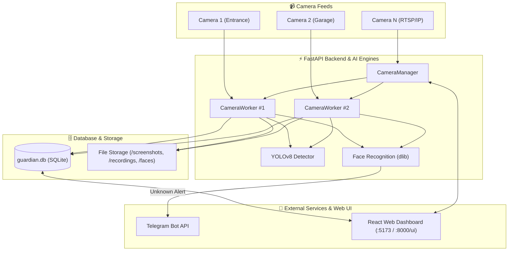

<div align="center">
  <h1>🛡️ Guardian AI</h1>
  <p><strong>Enterprise-Grade AI Security, Multi-Camera Surveillance, Face Recognition & Analytics Platform</strong></p>

  <p>
    
    
    
    
    
    
    
    
  </p>
</div>

<hr/>

## 📖 Overview

**Guardian AI** is an advanced, production-ready AI security system. Built with **Python, OpenCV, YOLOv8, FastAPI, and React**, it transforms standard IP cameras and RTSP video streams into an autonomous security command center.

Guardian AI performs **real-time person detection, face identification, smart video recording, selective Telegram alert dispatching, multi-camera management**, and **deep AI analytics** — all accessible via a modern, dark-mode web dashboard.

---

## ✨ Features & System Capabilities

### 🤖 1. Real-Time Person Detection & Video Recording
- **YOLOv8 Object Detection:** Instant detection of human subjects in live camera feeds.
- **Event-Driven Recording:** Automatically captures high-resolution screenshots and records video clips when a person enters the frame, stopping gracefully after a configured timeout.
- **Live HUD & Video Feeds:** Ultra-low-latency MJPEG live streams over HTTP.

### 🙂 2. Face Recognition & Identity Management
- **128-Dimensional Facial Encodings:** Uses `dlib` & `face_recognition` to identify registered individuals vs. unknown trespassers in real-time.
- **Interactive Face Enrollment:** Capture 20 sample training frames directly from live camera feeds to register new individuals with zero code changes.
- **Identity History:** View individual event history logs for any registered family member or employee.

### 📹 3. Multi-Camera Management
- **Independent Threaded Workers (`CameraWorker`):** Each camera executes its own multi-threaded detection and recognition loop.
- **Dynamic Camera Registry:** Add, configure, enable, or remove IP Webcams / RTSP cameras dynamically through the database and UI without restarting the server.
- **Location & Naming Tags:** Attach specific names and location labels (e.g., *Main Entrance*, *Garage*, *Backyard*) to every stream.

### 📲 4. Smart Telegram Alerts
- **Selective Alerting:** Only sends Telegram push notifications when **Unknown** visitors are detected, avoiding alert fatigue from known family members.
- **Rich Media Snapshots:** Instant photo alerts with detection timestamp, person count, and exact camera location attached.

### 🖥️ 5. Modern React Command Center
- **Dark-Mode UI:** Built with **React 18, Vite, Tailwind CSS, and Recharts**.
- **Live Grid & Camera Inspector:** Monitor single or multi-camera streams in real-time with HUD overlays.
- **Paginated Event Log:** Searchable detection history with inline screenshot modals and direct MP4 video downloads.
- **Camera & System Controls:** Start, stop, and configure individual camera engines directly from the browser.

### 📊 6. AI Analytics & Security Intelligence
- **Interactive Filtering:** Filter analytics across specific cameras or time ranges (7 Days, 30 Days, All Time).
- **Known vs. Unknown Split:** Visual donut chart & ratio metrics tracking visitor identities over time.
- **24-Hour Activity Heatmap:** Hourly frequency breakdown showing peak security threat windows.
- **Camera Activity Comparison:** Side-by-side performance and detection volume metrics across all cameras.

---

## 🏗️ System Architecture



---

## 🛠️ Tech Stack

| Layer | Technologies |
|---|---|
| **Frontend** | React 18, Vite, Tailwind CSS, Recharts, React Router DOM |
| **Backend API** | FastAPI, Uvicorn, Pydantic, Python 3.10+ |
| **AI & Computer Vision** | OpenCV, Ultralytics YOLOv8, dlib, face_recognition, NumPy |
| **Database** | SQLite (`guardian.db`), SQLite3 Python Driver |
| **Alerts & Messaging** | Telegram Bot API (`requests`) |

---

## 🚀 Quick Start Guide

### 1. Clone & Setup Python Environment
```bash
git clone https://github.com/KL2300030695/Guardian-AI.git
cd Guardian-AI/GuardianAI

# Create virtual environment
python -m venv venv
venv\Scripts\activate      # Windows
source venv/bin/activate   # macOS / Linux
```

### 2. Install Dependencies
```bash
pip install -r requirements.txt
```

### 3. Configure Credentials (`config.py`)
Edit `GuardianAI/config.py` with your Telegram Bot Token & Chat ID:
```python
BOT_TOKEN   = "YOUR_TELEGRAM_BOT_TOKEN"
CHAT_ID     = "YOUR_CHAT_ID"
CAMERA_URL  = "http://192.168.1.100:8080/video"   # Default stream
CONFIDENCE  = 0.5
RECORD_TIMEOUT = 10
```

### 4. Run Guardian AI Backend Server
```bash
python main.py
```
*The server will boot at `http://localhost:8000` and auto-initialize databases.*

### 5. Run React Web Dashboard (Dev Mode)
```bash
cd frontend
npm install
npm run dev
```
*Open **[http://localhost:5173](http://localhost:5173)** in your browser.*

> **Production Mode:** The compiled React app is also served directly by FastAPI at **[http://localhost:8000/ui](http://localhost:8000/ui)**.

---

## 📂 Project Structure

```text
Guardian-AI/
├── GuardianAI/
│   ├── config.py                 # 🔧 Credentials & global system defaults
│   ├── main.py                   # 🚀 FastAPI application entry point
│   ├── person_detection.py       # 🧪 Standalone legacy script
│   ├── requirements.txt          # 📦 Python package requirements
│   ├── backend/
│   │   ├── api.py                # 🌐 RESTful API routes & MJPEG endpoints
│   │   ├── camera_manager.py     # 🎛️ Multi-camera orchestrator
│   │   ├── camera_worker.py      # 🧵 Per-camera detection & recognition thread
│   │   ├── cameras_db.py         # 📁 Camera registry database access
│   │   ├── database.py           # 🗄️ Event database & analytics queries
│   │   ├── detector.py           # 🧠 YOLOv8 inference module
│   │   ├── face_database.py      # 🧑 Known face encodings storage
│   │   ├── face_matcher.py       # 🔍 Euclidean face matching engine
│   │   ├── notifier.py           # 📲 Smart Telegram alert module
│   │   └── recorder.py           # 🎥 OpenCV VideoWriter helper
│   ├── database/
│   │   └── guardian.db           # 💾 SQLite database
│   ├── faces/                    # 🖼️ Enrolled face sample images
│   ├── screenshots/              # 📸 Saved detection snapshots
│   ├── recordings/               # 🎥 Saved event video clips (.mp4)
│   └── frontend/                 # 💻 React + Tailwind Web App
│       ├── src/
│       │   ├── api.js            # 🔗 Centralized fetch client
│       │   ├── App.jsx           # 🧭 App router & primary layout
│       │   ├── components/       # 🧩 Navbar, Sidebar, LiveCamera, EventTable, StatsCard
│       │   └── pages/            # 📄 Dashboard, History, Analytics, Faces, Settings
│       ├── tailwind.config.js    # 🎨 Custom styling design system
│       └── vite.config.js        # ⚡ Vite build configuration
└── README.md                     # 📖 Project Documentation
```

---

## 🗺️ Completed Milestones & Phase Roadmap

- [x] **Phase 1:** IP Camera & RTSP Stream Integration
- [x] **Phase 2:** YOLOv8 Real-Time Person Detection
- [x] **Phase 3:** Automatic Screenshot & Video Recording
- [x] **Phase 4:** Event-Based Logic & Timeout Management
- [x] **Phase 5:** Live HUD Overlay & Telegram Snapshot Alerts
- [x] **Phase 6:** Modular Engine Refactoring
- [x] **Phase 7:** SQLite Event Database Storage (`database.py`)
- [x] **Phase 8:** FastAPI Service Architecture & REST Endpoints (`api.py`)
- [x] **Phase 9:** React Web Dashboard with MJPEG Streaming (`frontend/`)
- [x] **Phase 10:** Face Recognition, Enrollment & Smart Alerts (`dlib`, `known_faces`)
- [x] **Phase 11:** Multi-Camera Management Engine (`CameraManager`, `CameraWorker`)
- [x] **Phase 12:** AI Analytics & Security Intelligence Command Center

---

## 📝 License

Distributed under the MIT License. See `LICENSE` for details.

<br />
<div align="center">
  <i>Guardian AI — Intelligent AI Security & Surveillance System</i>
</div>
